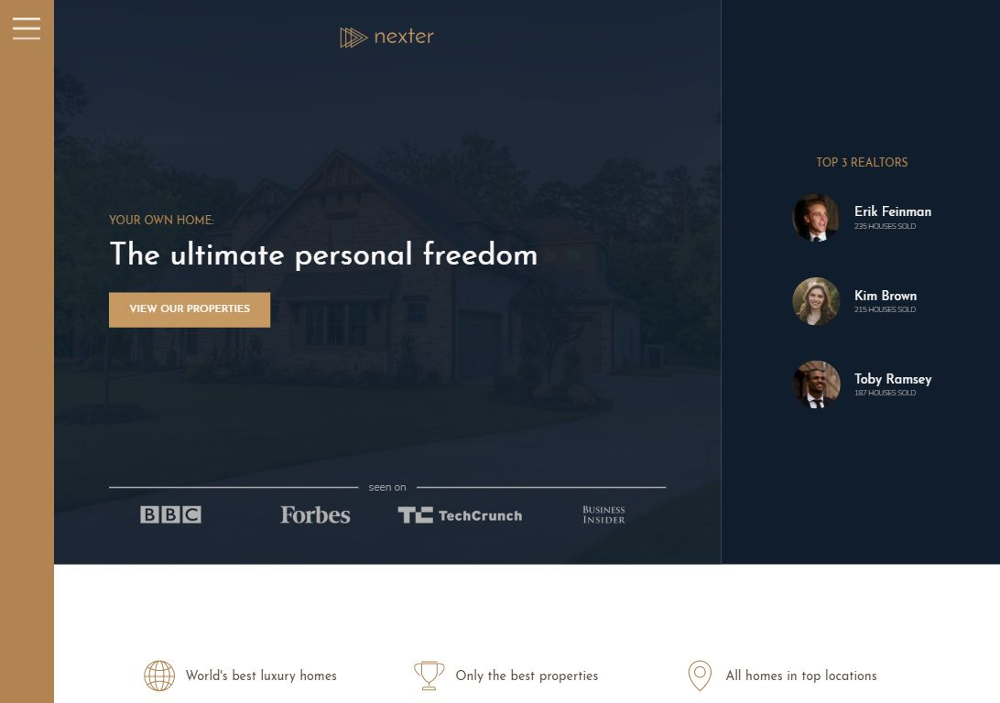
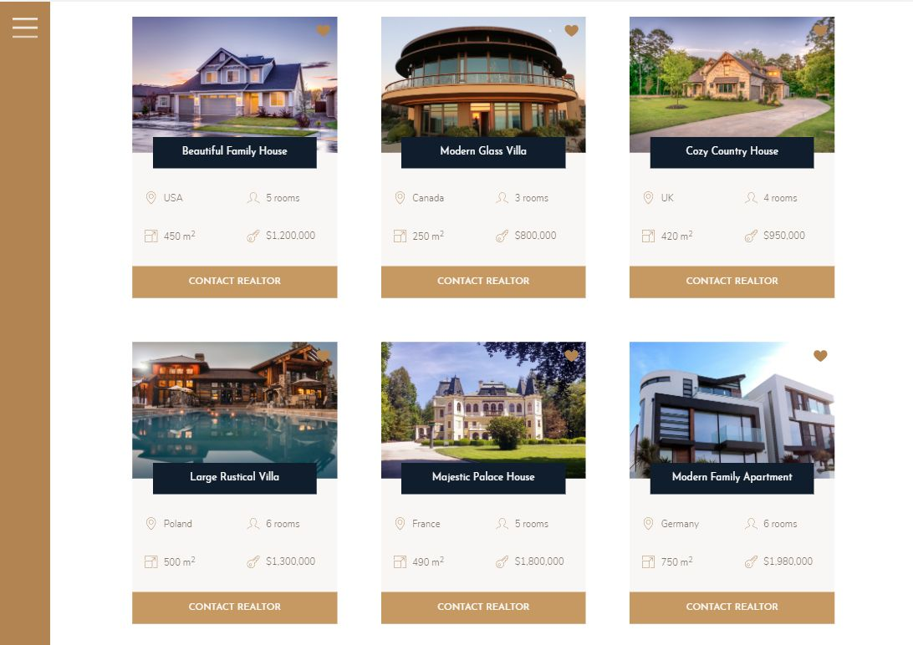
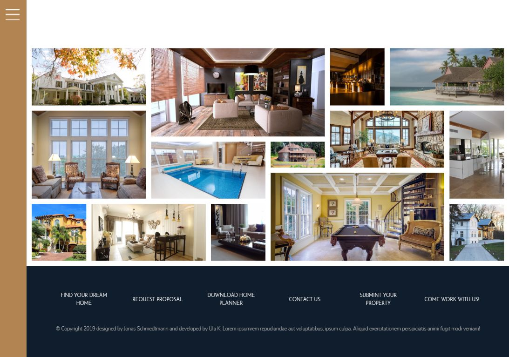
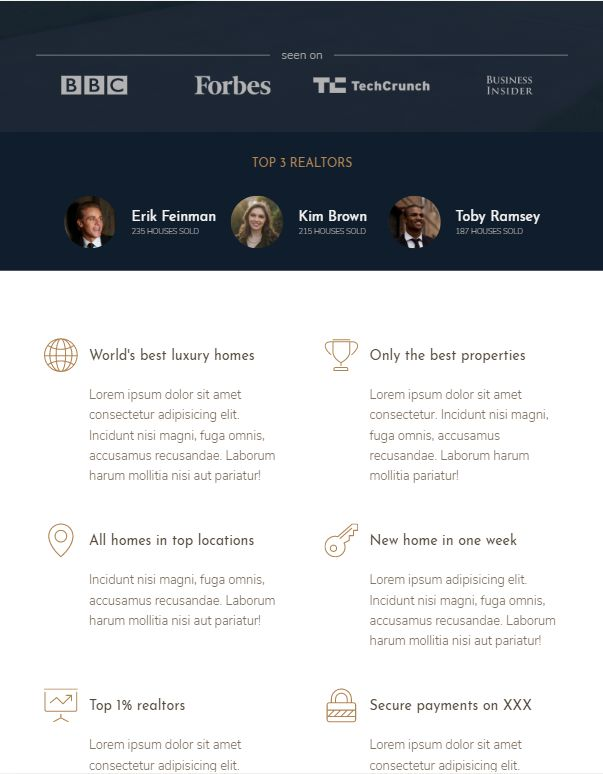

# NEXTER
## YOUR HOME, YOUR FREEDOM!

**If you want to try it out, click here: [Nexter webpage](https://ulakrawczyk.github.io/nexter/)**

### This is a simple webpage created during the Udemy course to practise css grid:
* using css grid for main layout
* adding minor grids for smaller components
* matching different row and column track sizes for different types of content
* mixing css grid with flex-box
* css grid gallery
* pseudoelements as grid items

### Page is responsive by:
* writing grid which is responsive without any media queries eg. section features
* adding media queries and correct units
* changing layout at certain breakpoints
* desktop first technique

#### To run my project locally, you need:

`npm install -g gulp-cli`

`npm install`

`gulp`
"# nexter" 
